# System Flowchart - English Learning & Exam Platform

## System Architecture Overview

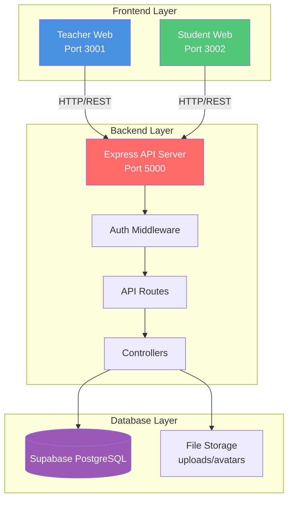

## Authentication Flow

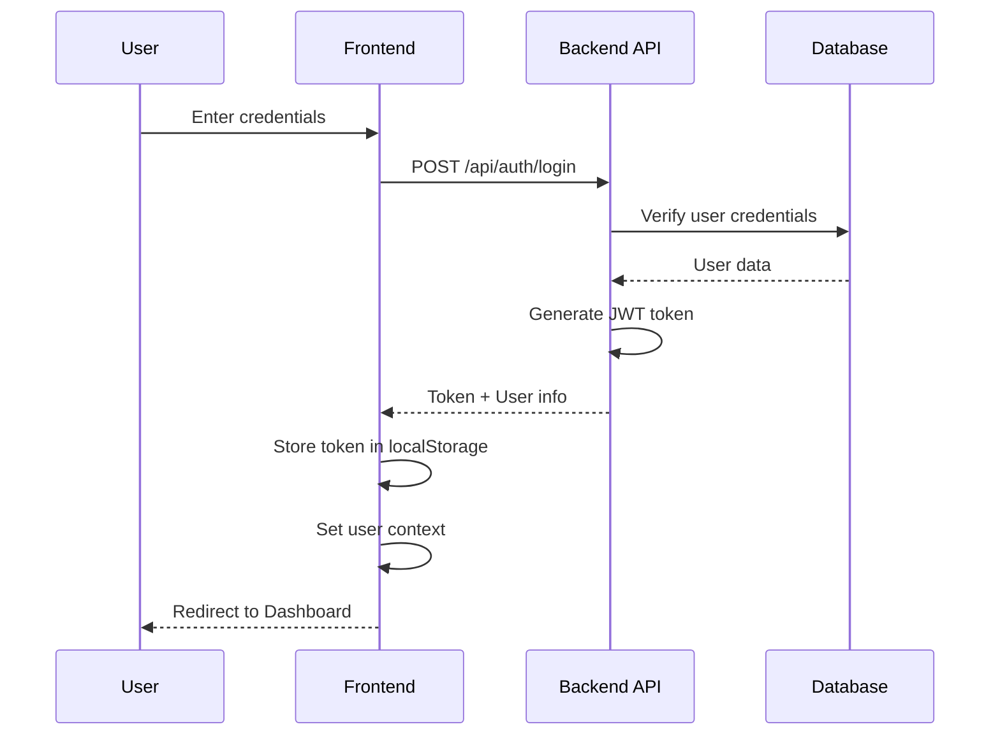

## Teacher Workflow

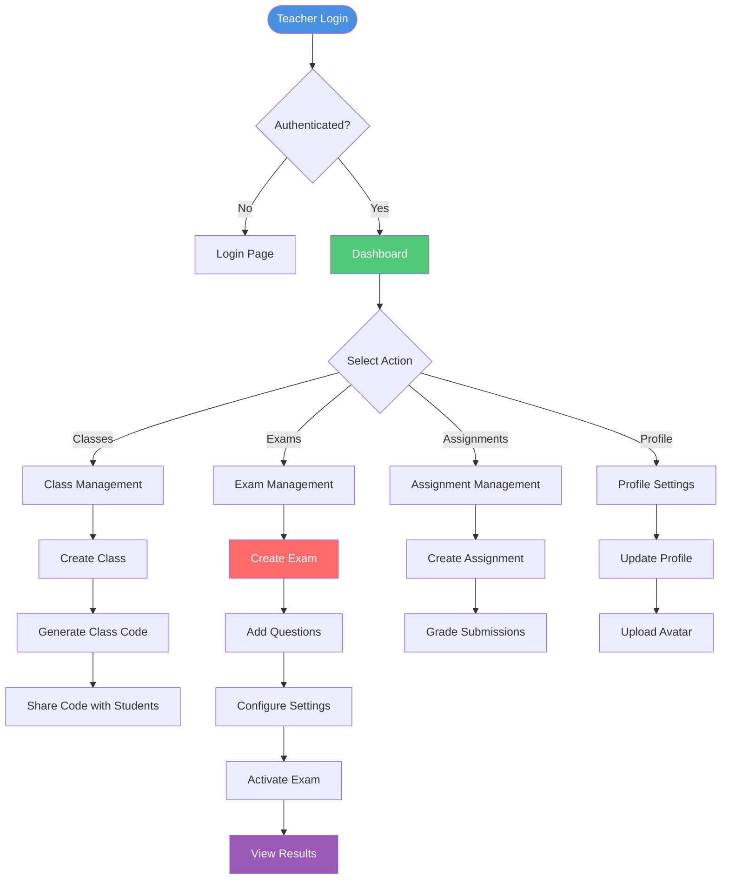

## Student Workflow

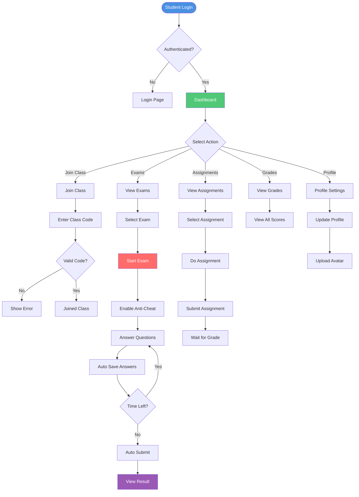

## Exam Flow (Detailed)

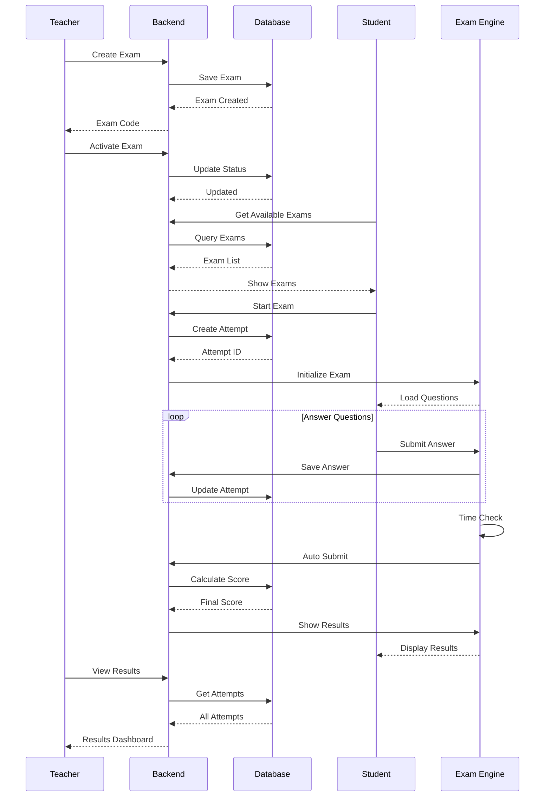

## Class Management Flow

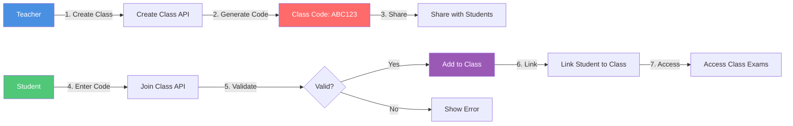

## Data Flow - Exam Submission

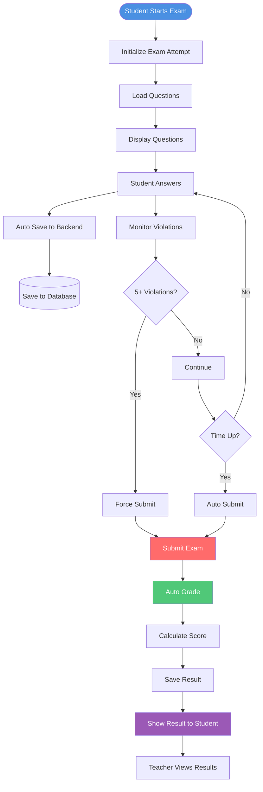

## Anti-Cheat System Flow

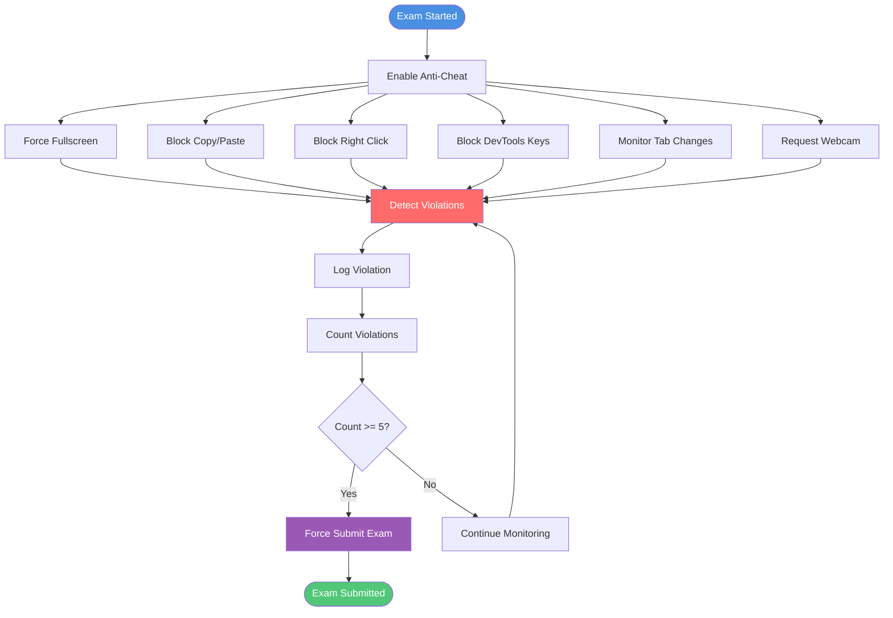

## API Request Flow

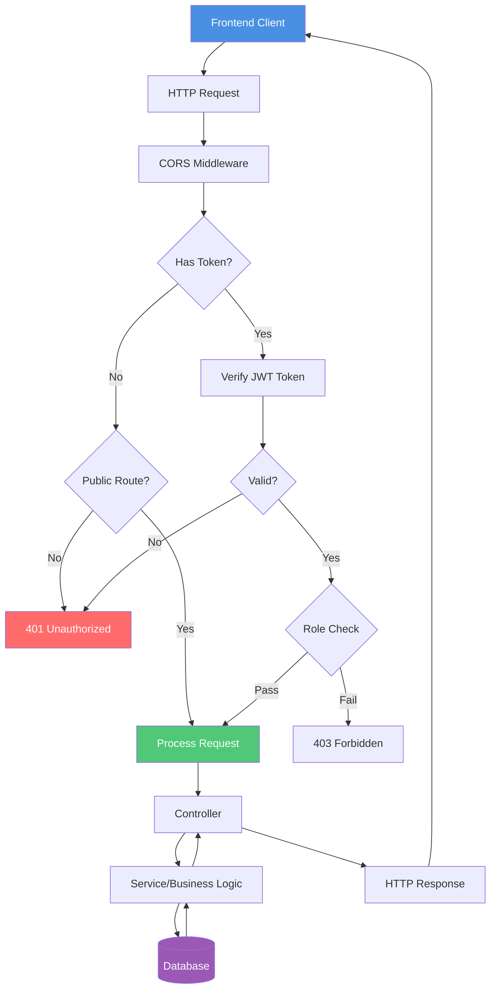

## File Upload Flow (Avatar)

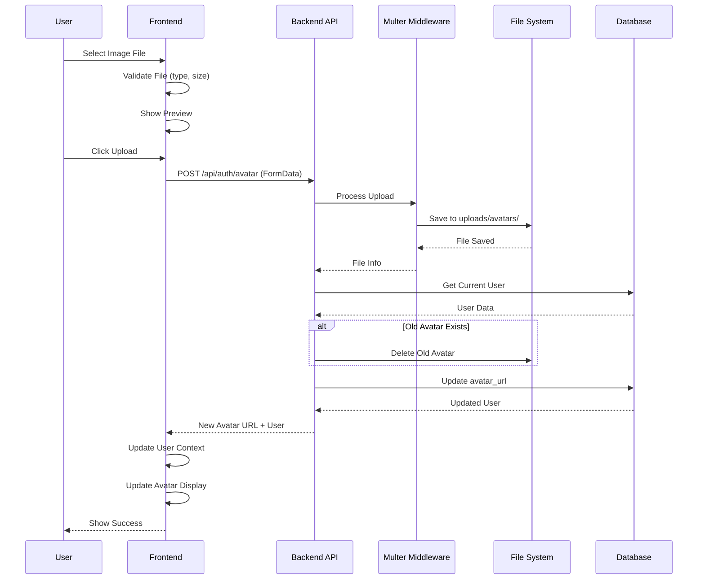

## Complete System Overview

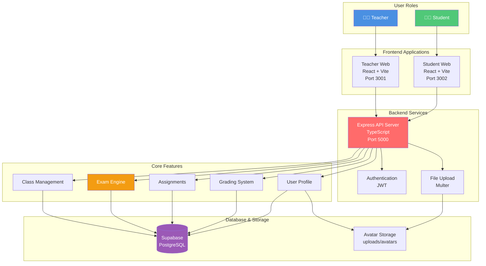

## Key Features Flow

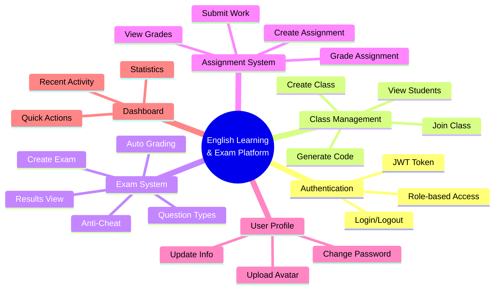

---

## Legend

- **Blue**: Teacher actions/features
- **Green**: Student actions/features  
- **Red**: Backend/API processes
- **Purple**: Database operations
- **Orange**: Critical processes (Exams)

## Notes

1. **Authentication**: All API requests (except login/register) require JWT token
2. **Role-based Access**: Teacher and Student have different permissions
3. **Real-time**: Exam violations are logged in real-time
4. **Auto-save**: Student answers are automatically saved during exam
5. **Auto-submit**: Exam automatically submits when time expires or violations exceed limit
6. **File Storage**: Avatars stored locally in `server/uploads/avatars/`

